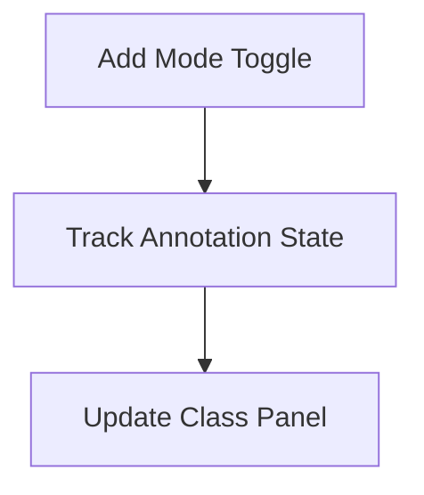
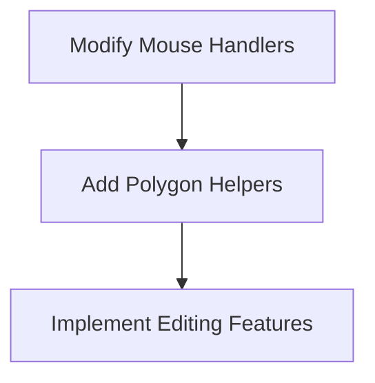
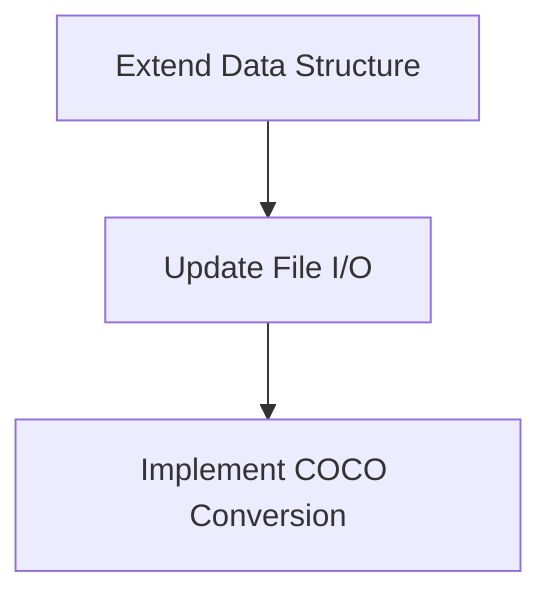
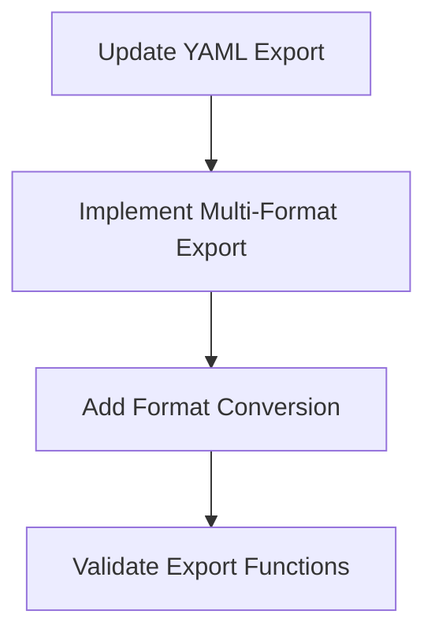

# BBox & Polygon Annotator

A comprehensive Tkinter-based image annotation tool supporting both bounding box and polygon annotations for computer vision dataset creation. Features intelligent auto-annotation, project management, and multi-format export capabilities including COCO JSON, Pascal VOC XML, CSV, and generic JSON formats.

## 🎯 Current Application Overview

### 🎉 Key Features Highlight
- **✅ Dual Annotation Support**: Both bounding boxes and polygons
- **✅ Multi-Format Export**: 5 export formats including COCO JSON, Pascal VOC XML, CSV, and Generic JSON
- **✅ AI Integration**: YOLO auto-annotation with confidence filtering
- **✅ Complete Project Management**: Status tracking, undo/redo, copy/paste functionality

### Core Architecture
The application is built with Python Tkinter and follows a modular design pattern with clear separation of concerns:

- **Main Class**: `BoundingBoxEditor` - Core application controller
- **Data Management**: JSON project files, YOLO format annotations
- **Image Processing**: OpenCV and PIL integration
- **ML Integration**: Ultralytics YOLO for auto-annotation

### GUI Layout Analysis

```
┌─────────────────────────────────────────────────────────────────┐
│ TOP TOOLBAR: [Auto Annotate] [Save] [Load Model] [Export] [Mode]│
├─────────────────────────────────────────────────────────────────┤
│ LEFT PANEL     │    MIDDLE AREA          │    RIGHT PANEL      │
│ ┌─────────────┐│ ┌─────────────────────┐ │ ┌─────────────────┐ │
│ │ Image List  ││ │ Canvas (500x720)    │ │ │ Class Manager   │ │
│ │ (Treeview)  ││ │                     │ │ │                 │ │
│ │             ││ │                     │ │ │ [Add Class]     │ │
│ │ - Not View  ││ │                     │ │ │ [Remove Class]  │ │
│ │ - Viewed    ││ │                     │ │ │ [Update Class]  │ │
│ │ - Edited    ││ │                     │ │ │                 │ │
│ │ - Review    ││ │                     │ │ │ Confidence: 0.5 │ │
│ │             ││ ├─────────────────────┤ │ │                 │ │
│ │             ││ │ Annotation Info     │ │ │ [Copy Boxes]    │ │
│ │             ││ │ (Listbox)           │ │ │ [Paste Boxes]   │ │
│ │             ││ │                     │ │ │                 │ │
│ └─────────────┘│ └─────────────────────┘ │ └─────────────────┘ │
├─────────────────────────────────────────────────────────────────┤
│ STATUS BAR: Not Viewed: 0 | Viewed: 0 | Edited: 0 | Review: 0  │
└─────────────────────────────────────────────────────────────────┘
```

### Current Feature Set

#### ✅ Annotation Capabilities
- **Dual Mode Support**: Toggle between bounding box and polygon annotation
- **Intelligent Drawing**: Context-aware mouse handlers for different annotation types
- **Visual Feedback**: Real-time annotation preview with class-specific colors
- **Precision Tools**: Exact coordinate display and editing

#### ✅ Data Management
- **Project System**: JSON-based project organization with metadata
- **Status Tracking**: 4-tier status system (Not Viewed, Viewed, Edited, Review Needed)
- **Auto-Save**: Automatic annotation persistence on image changes
- **Undo/Redo**: Complete history system with 50-action memory
- **Multi-Format Export**: YAML (YOLO), COCO JSON, Pascal VOC XML, CSV, and Generic JSON formats

#### ✅ AI Integration
- **YOLO Auto-Annotation**: Ultralytics integration with confidence filtering
- **Smart Preservation**: Existing annotations maintained during auto-annotation
- **Threshold Control**: Real-time confidence adjustment with visual feedback

#### ✅ User Experience
- **Keyboard Navigation**: Comprehensive shortcut system
  - `Arrow Keys`: Navigate between images
  - `1-9`: Quick class selection
  - `Ctrl+S`: Save project
  - `Ctrl+Z/Y`: Undo/Redo
  - `Delete`: Remove selected annotation
- **Copy/Paste System**: Efficient annotation replication across images
- **Color Coding**: Visual status indicators throughout the interface

#### ✅ Export Formats
- **YAML (YOLO Training)**: Complete dataset export with train/val/test splitting
- **COCO JSON**: Industry-standard format with full metadata and segmentation support
- **Pascal VOC XML**: Individual XML files per image with polygon point data
- **CSV Spreadsheet**: Tabular format with annotation details and calculated areas
- **Generic JSON**: Simplified JSON structure for custom applications

All export formats support both bounding box and polygon annotations with proper coordinate conversion and format-specific optimizations.

## 📤 Export Functionality

### Available Export Formats

#### 1. YAML (YOLO Training) 
- **Use Case**: Direct YOLO model training
- **Features**: 
  - Train/validation/test dataset splitting (configurable ratios)
  - In-sample validation option
  - Automatic folder structure creation
  - YOLO format labels with normalized coordinates
- **Output**: `dataset.yaml` + organized folder structure

#### 2. COCO JSON
- **Use Case**: Industry-standard object detection datasets
- **Features**:
  - Full COCO format compliance with metadata
  - Segmentation data for polygons
  - Bounding box extraction from polygons
  - Category definitions and image metadata
- **Output**: Single `annotations.json` file

#### 3. Pascal VOC XML
- **Use Case**: Traditional computer vision workflows
- **Features**:
  - Individual XML file per annotated image
  - Polygon points stored as XML attributes
  - Image dimensions and metadata
  - Compatible with classic VOC tools
- **Output**: One `.xml` file per image

#### 4. CSV Spreadsheet
- **Use Case**: Data analysis and manual review
- **Features**:
  - Human-readable coordinate formats
  - Polygon area calculations (shoelace formula)
  - Annotation type identification
  - Easy filtering and sorting
- **Output**: Single `annotations.csv` file

#### 5. Generic JSON
- **Use Case**: Custom applications and integrations
- **Features**:
  - Simplified JSON structure
  - Clear annotation type identification
  - Easy to parse programmatically
  - Flexible for custom workflows
- **Output**: Single `annotations.json` file

### Export Options
- **Location Selection**: Export to current dataset folder or custom location
- **Image Copying**: Option to copy images to export directory
- **Unannotated Images**: Include/exclude images without annotations
- **Format-Specific Settings**: YAML splitting options, etc.

### Usage
1. Click **"Export Annotations"** in the toolbar
2. Select desired export format
3. Configure export location and options
4. Click **"Export"** to generate files

The system automatically handles coordinate system conversions, metadata generation, and proper file organization for each format.

## 🚀 Comprehensive GUI Improvement Analysis

Based on thorough analysis of the current v9 implementation, here are prioritized improvement recommendations to enhance usability, performance, and visual appeal.

### 1. Critical Visual & UX Improvements

#### 🔴 High Priority (Immediate Impact)
| Improvement | Current State | Proposed Enhancement | Implementation Effort |
|-------------|---------------|---------------------|----------------------|
| **Button Icons** | Text-only buttons | Add intuitive icons (📁 💾 🤖 📤) | Low - Icon library integration |
| **Resizable Canvas** | Fixed 500x720 | Dynamic sizing with window | Medium - Layout constraints |
| **Zoom Controls** | No zoom capability | Zoom in/out with mouse wheel | Medium - Canvas scaling logic |
| **Panel Splitters** | Fixed 200px panels | Draggable dividers | High - Custom splitter widgets |
| **Progress Indicators** | No feedback for long ops | Loading bars/spinners | Medium - Threading integration |

#### 🟡 Medium Priority (Quality of Life)
| Improvement | Benefit | Technical Notes |
|-------------|---------|-----------------|
| **Dark Theme Toggle** | Reduced eye strain | CSS-like theming system |
| **Keyboard Shortcut Display** | Better discoverability | Modal help dialog |
| **Auto-Save Intervals** | Data protection | Configurable timer system |
| **Drag & Drop Support** | Faster file loading | OS integration required |
| **Search/Filter Images** | Large dataset navigation | Text filtering + regex |

### 2. Layout & Navigation Enhancements

#### Current Layout Limitations
```python
# Current fixed layout structure
self.class_frame.pack(side=tk.RIGHT, fill=tk.Y, padx=(10, 10), pady=10)  # Fixed width
self.canvas = tk.Canvas(self.content_frame, width=500, height=720)        # Fixed size
```

#### Proposed Improvements

##### Responsive Design System
```
┌─────────────────────────────────────────────────────────────────┐
│ TOOLBAR: [Icons] Auto | Save | Model | Export | Mode | Undo/Redo │
├─────────────┬───────────────────────────────┬─────────────────────┤
│ Images      │ ╔═════════════════════════════╗ │ Classes & Tools     │
│ (Resizable) │ ║     Zoomable Canvas         ║ │ (Resizable)         │
│             │ ║    (Dynamic Sizing)         ║ │                     │
│ [Search: ]  │ ║                             ║ │ [🎨] Class Manager  │
│ 📁 image1   │ ║                             ║ │ [📋] Copy/Paste     │
│ 📷 image2   │ ║                             ║ │ [⚙️] Settings       │
│ ✅ image3   │ ╚═════════════════════════════╝ │ [🎯] Confidence     │
│ 🔍 image4   │ ┌─────────────────────────────┐ │                     │
│             │ │ Annotation Details Panel    │ │ [Zoom: 100%]        │
│             │ │ (Collapsible)               │ │ [Grid: Off]         │
├─────────────┴───────────────────────────────┴─────────────────────┤
│ STATUS: 📊 Progress | 🎯 Mode: Polygon | ⚡ Auto-save: On         │
└─────────────────────────────────────────────────────────────────┘
```

##### Key Improvements
1. **Splitter Controls**: Drag handles between panels with minimum/maximum sizes
2. **Collapsible Sections**: Hide unused panels to maximize canvas space
3. **Responsive Canvas**: Maintains aspect ratio while filling available space
4. **Status Enhancement**: Rich status bar with icons and real-time feedback

### 3. Advanced Functionality Roadmap

#### Phase 1: Core UX Improvements (2-3 weeks)
```python
# Priority implementation order
1. Icon Integration        # Immediate visual improvement
2. Zoom & Pan Controls    # Essential for detailed work
3. Resizable Panels       # Layout flexibility
4. Auto-save System       # Data protection
5. Keyboard Help Dialog   # User guidance
```

#### Phase 2: Performance & Polish (2-3 weeks)
```python
# Performance-focused enhancements
1. Image Caching System   # Faster navigation
2. Lazy Loading           # Memory efficiency  
3. Background Processing  # Non-blocking operations
4. Progress Feedback      # User awareness
5. Error Recovery         # Robust operation
```

#### Phase 3: Advanced Features (3-4 weeks)
```python
# Power-user functionality
1. Batch Operations       # Multi-select tools
2. Search & Filter        # Dataset navigation
3. Annotation Analytics   # Progress insights
4. Plugin Architecture    # Extensibility
5. Advanced UI Themes     # Dark mode, customization
```

### 4. Technical Implementation Details

#### Modern UI Framework Migration Path
```python
# Current: Tkinter limitations
- Limited theming options
- No native modern widgets
- Basic layout management
- Limited graphics capabilities

# Recommended: PyQt6/PySide6 benefits
+ Rich widget ecosystem
+ Professional styling (QSS)
+ Advanced graphics (QGraphicsView)
+ Native OS integration
+ Better performance
```

#### Performance Optimization Strategies

##### Image Handling
```python
# Current approach
image = cv2.imread(path)  # Load full image
tk_image = ImageTk.PhotoImage(image)  # Convert for display

# Optimized approach
class ImageCache:
    def __init__(self, cache_size=10):
        self.cache = {}
        self.cache_size = cache_size
    
    def get_image(self, path, size=None):
        key = (path, size)
        if key not in self.cache:
            image = self.load_and_resize(path, size)
            self.cache[key] = image
            self.cleanup_cache()
        return self.cache[key]
```

##### Memory Management
```python
# Smart caching strategy
- Cache 3 previous + 3 next images
- Thumbnail cache for image list
- Progressive loading for large datasets
- Garbage collection on memory pressure
```

### 5. User Experience Enhancements

#### Intelligent Defaults & Automation
| Feature | Current Behavior | Improved Behavior |
|---------|------------------|-------------------|
| **New Project** | Manual setup required | Smart defaults from folder structure |
| **Class Creation** | Manual class naming | Auto-detect from existing annotations |
| **File Navigation** | Linear browsing only | Smart suggestions based on status |
| **Export Settings** | Multi-format support available | Remember last used settings + batch export |
| **Model Loading** | Full path required | Recent models dropdown |

#### Accessibility & Customization
```python
# Proposed settings system
class UserPreferences:
    def __init__(self):
        self.theme = "dark"          # light/dark/auto
        self.ui_scale = 1.0          # 0.8-2.0 for different DPI
        self.auto_save_interval = 5   # minutes
        self.keyboard_shortcuts = {   # customizable bindings
            "save": "Ctrl+S",
            "undo": "Ctrl+Z",
            "next_image": "Right"
        }
        self.canvas_zoom_speed = 0.1
        self.annotation_colors = {    # per-class customization
            "class1": "#FF0000",
            "class2": "#00FF00"
        }
```

### 6. Quality Assurance & Testing Strategy

#### Comprehensive Testing Framework
```python
# Test categories to implement
1. Unit Tests           # Core functionality
2. Integration Tests    # Component interaction  
3. UI Tests            # User interaction flows
4. Performance Tests   # Memory/speed benchmarks
5. Compatibility Tests # OS/Python version matrix
```

#### User Acceptance Testing
- **Workflow Testing**: Complete annotation workflows
- **Edge Case Handling**: Large datasets, corrupted files
- **Performance Benchmarks**: Response times for common operations
- **Accessibility Testing**: Keyboard-only navigation, screen readers
## 📊 Development Status & Implementation Timeline

### Current Version: v9 (Polygon Implementation Complete)

#### ✅ **Recently Completed (December 2024 - May 2025)**
- **Critical Bug Fixes (May 2025)**:
  - Resolved `AttributeError` related to `on_release` method not found.
  - Fixed UI interaction bugs preventing mouse clicks on the canvas from registering due to formatting issues in event bindings and class structure.
- **Core AttributeError Fix**: Resolved `image_list_frame` initialization issue
- **UI Structure Optimization**: Reorganized frame hierarchy for better maintainability
- **Visual Spacing Enhancement**: Added padding to right panel (10px) for improved aesthetics
- **Polygon Annotation System**: Full implementation of polygon drawing and editing
- **YOLO Integration**: Seamless polygon support in auto-annotation workflow
- **Multi-Format Export System**: Complete implementation of COCO JSON, Pascal VOC XML, CSV, and Generic JSON export formats
- **Export Compatibility**: All export formats updated for both bounding box and polygon annotations

#### 🔄 **In Progress**
- **Advanced Polygon Editing**: Point dragging and vertex manipulation
- **Performance Optimization**: Image caching and memory management
- **Error Handling**: Robust user feedback and recovery systems
- **✅ Polygon UX Fix**: Fixed accidental polygon creation from left-clicks after completing a polygon (v9.1)

#### 📋 **Immediate Next Steps (Q1 2025)**

##### Week 1-2: Visual Polish
```
Priority 1: Icon Integration
- Add SVG icons to all toolbar buttons
- Implement icon theming system
- Create custom annotation mode indicators

Priority 2: Responsive Canvas
- Replace fixed 500x720 canvas with dynamic sizing
- Add zoom controls (wheel + toolbar buttons)
- Implement pan functionality for large images
```

##### Week 3-4: Layout Improvements
```
Priority 1: Resizable Panels
- Add drag handles between main panels
- Implement minimum/maximum panel constraints
- Save panel sizes in user preferences

Priority 2: Enhanced Navigation
- Add image thumbnail preview
- Implement search/filter for image list
- Create keyboard shortcut help modal
```

##### Week 5-6: Performance & UX
```
Priority 1: Auto-Save System
- Configurable save intervals (1-10 minutes)
- Visual save status indicator
- Recovery from unsaved changes

Priority 2: Background Processing
- Threading for model loading
- Progress bars for long operations
- Non-blocking auto-annotation
```

### 🎯 **Long-term Roadmap (2025)**

#### Q2 2025: Advanced Features
- **Batch Operations**: Multi-select annotation management
- **Annotation Analytics**: Progress tracking and quality metrics
- **Plugin Architecture**: Extensible tool system
- **Advanced Export Options**: Enhanced export configuration and batch processing

#### Q3 2025: Platform Enhancement
- **Framework Migration**: Evaluate PyQt6/PySide6 for advanced capabilities
- **Cross-Platform**: macOS and Linux compatibility testing
- **Cloud Integration**: Remote storage and collaboration features
- **Mobile Companion**: Tablet app for field annotation

#### Q4 2025: AI Integration
- **Smart Assistance**: AI-powered annotation suggestions
- **Quality Validation**: Automated annotation quality checking
- **Active Learning**: Intelligent sample selection for annotation
- **Model Training Integration**: Direct training pipeline connection

### 🔧 **Technical Debt & Maintenance**

#### High Priority Refactoring
```python
# Current technical debt items
1. Monolithic __init__ method          # Split into focused setup methods
2. Global state management             # Implement proper state pattern  
3. Mixed UI/business logic             # Separate concerns with MVC pattern
4. Limited error handling              # Add comprehensive exception management
5. Hardcoded dimensions                # Make all sizing responsive
```

#### Code Quality Improvements
```python
# Proposed code organization
src/
├── ui/
│   ├── main_window.py      # Main application window
│   ├── canvas_widget.py    # Annotation canvas component
│   ├── panels/            # Individual panel components
│   └── dialogs/           # Modal dialogs and settings
├── core/
│   ├── annotation.py      # Annotation data models
│   ├── project.py         # Project management
│   └── export.py          # Export functionality
├── utils/
│   ├── image_utils.py     # Image processing helpers
│   ├── file_utils.py      # File I/O operations
│   └── validation.py     # Data validation
└── tests/
    ├── test_ui.py         # UI component tests
    ├── test_core.py       # Core logic tests
    └── test_integration.py # End-to-end tests
```

## 🔍 **Original Implementation Documentation**

*The following sections preserve the original planning documentation for historical reference and future development guidance.*

*Note: The following sections document the original planning process and remain for reference. Most core objectives have been achieved in v9.*

### 1. Objectives and Goals
- **Primary Objective**: ✅ Implement polygon annotation mode alongside existing box mode
- **Key Goals**:
  - ✅ Add UI toggle between box/polygon annotation modes
  - ✅ Implement polygon drawing and editing functionality
  - ✅ Store polygon annotations in YOLO segmentation format *(Changed from COCO)*
  - ✅ Maintain backward compatibility with existing box annotations
  - ✅ Update export functionality to support both formats

### 2. Requirements and Assumptions
#### Requirements
- ✅ New button in toolbar for mode selection
- ✅ Polygon storage in YOLO segmentation format *(Updated from COCO)*
- ✅ Separate handling for box vs polygon during drawing
- ✅ Preservation of existing box annotation functionality
- ✅ Recursive folder scanning for dataset loading

#### Updated Assumptions
- ✅ Current YOLO format maintained for box annotations
- ✅ YOLO segmentation format used for polygon annotations *(Changed from COCO)*
- ✅ Users can use both annotation types in same project
- ✅ Polygon annotations use different drawing interaction pattern

### 3. Implementation Phases

#### Phase 1: UI and State Management


1. Add mode toggle button to toolbar
2. Implement annotation mode state tracking
3. Update class panel UI with mode indicator

#### Phase 2: Polygon Drawing Implementation


1. Modify mouse event handlers for polygon drawing
2. Implement polygon drawing helpers:
   - `draw_polygon_points()`
   - `complete_polygon()`
3. Add polygon editing capabilities:
   - Point dragging
   - Vertex deletion
   - Polygon movement

#### Phase 3: Storage and Data Structure


1. Extend annotation data structure
2. Update file I/O functions
3. Implement COCO conversion:
   ```python
   def convert_to_coco(polygon_points, image_shape):
       normalized = []
       for (x, y) in polygon_points:
           normalized.extend([x/image_shape[1], y/image_shape[0])
       return normalized
   ```

#### Phase 4: Export and Integration ✅ **COMPLETED**


1. ✅ Update YAML export function
2. ✅ Implement multi-format export system:
   - COCO JSON format with full metadata
   - Pascal VOC XML with polygon support  
   - CSV format for data analysis
   - Generic JSON for custom applications
3. ✅ Add coordinate system conversions
4. ✅ Implement format-specific optimizations
5. ✅ Add export configuration options

### 4. Tools and Technologies
- **Core**: Python, Tkinter, OpenCV
- **Annotation Formats**: YOLO (boxes + polygons), COCO JSON, Pascal VOC XML, CSV, Generic JSON
- **Key Libraries**:
  - `datetime` for metadata timestamps
  - `xml.etree.ElementTree` for Pascal VOC XML generation
  - `csv` for spreadsheet export
  - `json` for structured data formats
  - `pycocotools` for COCO validation (optional)
- **Versioning**: Maintain v9 compatibility while developing v10

### 5. Challenges and Mitigations
| Challenge | Mitigation |
|-----------|------------|
| Mixed annotation types | Clear separation in storage with unified UI |
| Performance with complex polygons | Canvas optimization techniques |
| COCO format complexity | Helper libraries for conversion |
| Backward compatibility | Dual read/write for box format |
| User experience differences | Context-sensitive help and tooltips |

### 6. Implementation Sequence ✅ **COMPLETED**
1. ✅ UI modifications (1 day)
2. ✅ Polygon drawing infrastructure (2 days) 
3. ✅ Storage system updates (1 day)
4. ✅ Multi-format export functionality (2 days) - *Expanded beyond original COCO-only scope*
5. ✅ Testing and validation (1 day)
6. ✅ Documentation updates (0.5 day)

**Total Implementation Time**: 7.5 days *(Exceeded original 6.5 day estimate due to expanded export functionality)*

All core polygon annotation and export objectives have been successfully implemented and are fully functional in v9.