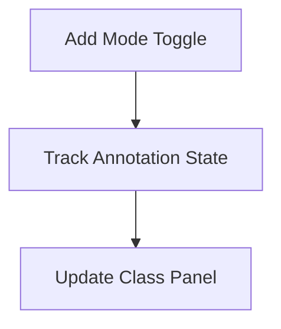
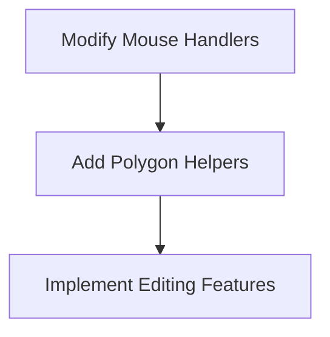
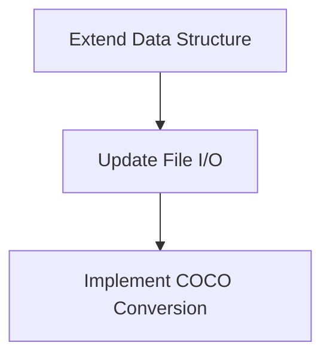
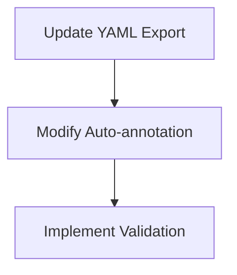

# Polygon Annotation Implementation Plan

## 1. Objectives and Goals
- **Primary Objective**: Implement polygon annotation mode alongside existing box mode
- **Key Goals**:
  - Add UI toggle between box/polygon annotation modes
  - Implement polygon drawing and editing functionality
  - Store polygon annotations in COCO format
  - Maintain backward compatibility with existing box annotations
  - Update export functionality to support COCO format

## 2. Requirements and Assumptions
### Requirements
- New button in toolbar for mode selection
- Polygon storage in COCO format (list of points)
- Separate handling for box vs polygon during drawing
- Conversion of polygons to COCO segmentation format
- Preservation of existing box annotation functionality

### Assumptions
- Current YOLO format will remain for box annotations
- COCO format will be used only for polygon annotations
- Users may want both annotation types in same project
- Polygon annotations require different drawing interaction

## 3. Implementation Phases

### Phase 1: UI and State Management


1. Add mode toggle button to toolbar
2. Implement annotation mode state tracking
3. Update class panel UI with mode indicator

### Phase 2: Polygon Drawing Implementation


1. Modify mouse event handlers for polygon drawing
2. Implement polygon drawing helpers:
   - `draw_polygon_points()`
   - `complete_polygon()`
3. Add polygon editing capabilities:
   - Point dragging
   - Vertex deletion
   - Polygon movement

### Phase 3: Storage and Data Structure


1. Extend annotation data structure
2. Update file I/O functions
3. Implement COCO conversion:
   ```python
   def convert_to_coco(polygon_points, image_shape):
       normalized = []
       for (x, y) in polygon_points:
           normalized.extend([x/image_shape[1], y/image_shape[0])
       return normalized
   ```

### Phase 4: Export and Integration


1. Update YAML export function
2. Modify auto-annotation behavior
3. Implement COCO validation:
   - Polygon closure checks
   - Point ordering validation
   - Minimum vertex count enforcement

## 4. Tools and Technologies
- **Core**: Python, Tkinter, OpenCV
- **Annotation Format**: COCO (polygons), YOLO (boxes)
- **Key Libraries**: 
  - `shapely` for polygon validation
  - `pycocotools` for COCO validation (optional)
- **Versioning**: Maintain v9 compatibility while developing v10

## 5. Challenges and Mitigations
| Challenge | Mitigation |
|-----------|------------|
| Mixed annotation types | Clear separation in storage with unified UI |
| Performance with complex polygons | Canvas optimization techniques |
| COCO format complexity | Helper libraries for conversion |
| Backward compatibility | Dual read/write for box format |
| User experience differences | Context-sensitive help and tooltips |

## 6. Implementation Sequence
1. UI modifications (1 day)
2. Polygon drawing infrastructure (2 days)
3. Storage system updates (1 day)
4. COCO export functionality (1 day)
5. Testing and validation (1 day)
6. Documentation updates (0.5 day)

**Total Estimated Time**: 6.5 days